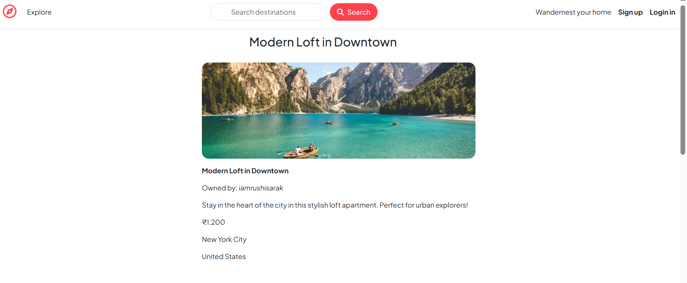
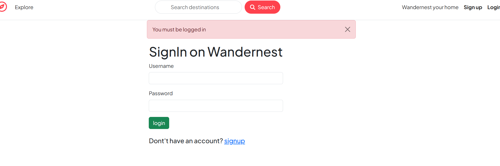
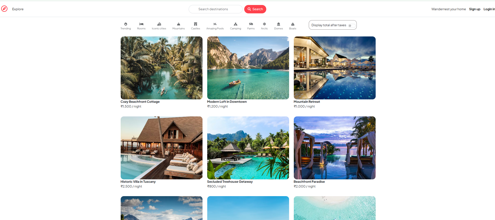

# 🌍 WanderNest – Major Project

WanderNest is a full-stack web application inspired by Airbnb that allows users to explore, list, and review travel destinations.  
This project is developed as part of a **Major Project** using the **MERN stack**.

---

## 🚀 Features

- User authentication (Signup / Login / Logout)
- Create, edit, and delete property listings
- Add and delete reviews
- Image upload using Cloudinary
- Interactive maps integration
- Secure routes with authentication & authorization
- Responsive UI using EJS templates

---

## 🛠️ Tech Stack

### Backend
- Node.js
- Express.js
- MongoDB
- Mongoose
- Passport.js (Authentication)

### Frontend
- EJS
- CSS
- JavaScript

### Tools & Services
- Cloudinary (Image storage)
- Mapbox (Maps)
- Git & GitHub

---

**SCREENSHOT**

